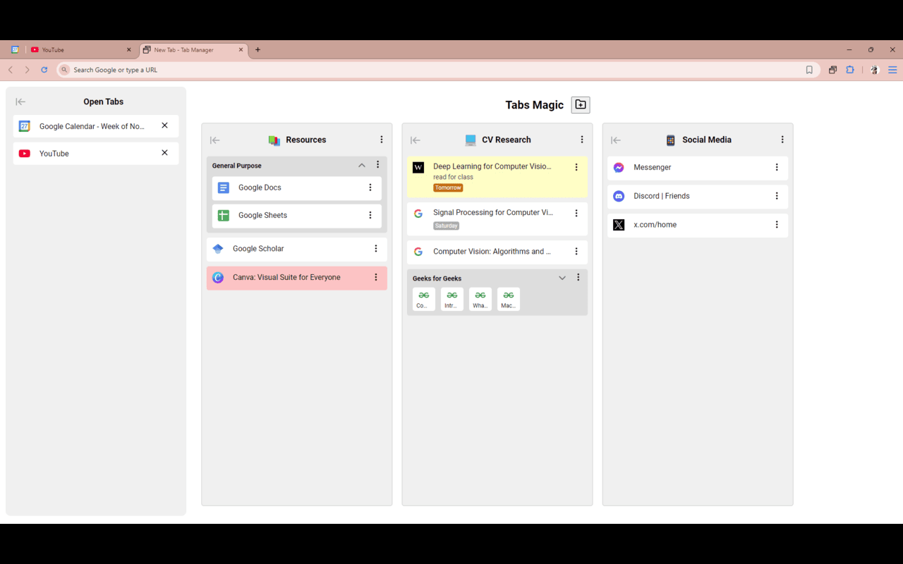

# Tabs Magic

Tabs Magic is a browser extension designed to help you organize and manage your tabs through a visual, drag-and-drop interface. It allows you to create collapsible columns and subgroups, personalize tabs with colors and custom names, and set reminders using natural language scheduling. 

## Features

- **Organize Without Limits**: Create collapsible columns and subgroups to keep your workspace tidy and navigate with ease.

- **Personalization**: Customize your tabs with color coding, custom names, and natural language scheduling for due dates.

- **User-Friendly Interface**: Enjoy a clean interface with intuitive drag-and-drop functionality and bulk actions for multi-select, making tab management effortless.

## Installation

Tabs Magic is available for multiple browsers:

- **Chrome and Other Chromium Browsers**: Available on the [Chrome Web Store](https://chromewebstore.google.com/detail/tabs-magic/epjcnbdchmflcppaajkbckidicdmpmnc). 

- **Firefox**: Available on the [Firefox Add-ons site](https://addons.mozilla.org/en-US/firefox/addon/tabs-magic/).

## Usage

1. **Saving Tabs**: Drag and drop tabs into a column from the New Tab page to save them.

2. **Rearranging**: Use drag-and-drop to rearrange tabs and columns as needed.

3. **Customization**: Rename tabs, apply colors, add notes, and set reminders using natural language dates like "3 days from now" or "Nov 1".

4. **Grouping**: Create groups within columns by dragging tabs on top of each other, and collapse columns using the minimize button for a cleaner workspace.

## Contributing

Contributions from the community are welcome. To contribute:

1. **Fork the Repository**: Click the 'Fork' button at the top right of this page to create a copy of this repository under your GitHub account.

2. **Clone Your Fork**: Use `git clone` to download your forked repository to your local machine.

3. **Create a Branch**: Create a new branch for your feature or bug fix.

4. **Make Changes**: Implement your changes in this branch.

5. **Test Changes**: Ensure that your changes work as intended and do not introduce any new issues.

6. **Commit and Push**: Commit your changes and push the branch to your forked repository on GitHub.

7. **Submit a Pull Request**: Open a pull request to merge your changes into the main repository.

## Acknowledgements

Tabs Magic was developed by Sage Wang. Special thanks to all users who have provided feedback and support.

For more information, visit the [official website](https://tabsmagic.com/).
